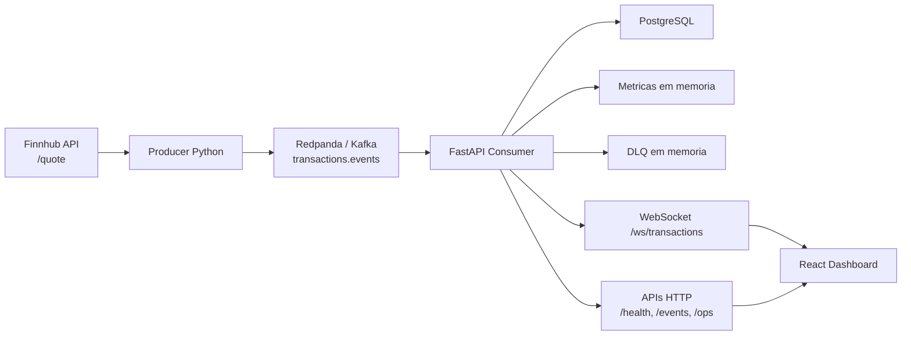

# BTG FinStream Dashboard

Plataforma de monitoramento de transacoes financeiras em tempo real, orientada a eventos, com foco em observabilidade operacional, persistencia historica e visualizacao institucional para mesas, assessorias e operacoes de investimento.

## 1. Descricao Executiva

O **BTG FinStream Dashboard** e um projeto de portfolio tecnico construido para demonstrar, de ponta a ponta, uma arquitetura moderna de streaming financeiro. O sistema combina ingestao de eventos em tempo real, integracao com mercado via API externa, processamento backend resiliente, persistencia relacional, entrega via WebSocket e uma interface React com visual inspirado em terminais institucionais.

O projeto nao simula apenas uma tela bonita: ele materializa um fluxo operacional realista para monitoramento de transacoes, com **pipeline assinado por eventos**, **deduplicacao**, **DLQ em memoria**, **metricas operacionais**, **persistencia em PostgreSQL** e **atualizacao ao vivo no frontend**.

## 2. Problema Que o Projeto Resolve

Em ambientes financeiros, nao basta registrar uma transacao. E necessario:

- acompanhar o fluxo de eventos em tempo real;
- identificar falhas de ingestao sem derrubar o pipeline;
- manter historico consultavel para auditoria e investigacao;
- expor saude operacional para times tecnicos e de negocio;
- transformar dados brutos em uma camada visual util para supervisao operacional.

Sem isso, desks, operacoes e times de tecnologia operam com baixa visibilidade, resposta tardia a incidentes e pouca confianca sobre o estado real do sistema.

## 3. Solucao Proposta

O BTG FinStream Dashboard implementa uma arquitetura enxuta, mas orientada a praticas de producao:

- um **producer em Python** gera eventos transacionais e publica em **Redpanda/Kafka**;
- os precos utilizados sao obtidos em tempo real via **Finnhub**;
- o contexto transacional continua parcialmente controlado por simulacao, mantendo previsibilidade do dominio;
- um **backend FastAPI** consome, valida, persiste e transmite eventos;
- o backend mantem **metricas em memoria** para leitura imediata;
- eventos invalidos vao para uma **DLQ local em memoria**, sem interromper o fluxo principal;
- um **frontend React + Vite** consome HTTP e WebSocket para apresentar o painel institucional em tempo real.

## 4. Arquitetura da Solucao



### Componentes principais

- **Producer**: publica eventos no topico `transactions.events`.
- **Redpanda**: broker Kafka-compatible para streaming local.
- **FastAPI**: camada de consumo, validacao, persistencia e exposicao de APIs.
- **PostgreSQL**: armazenamento historico de eventos processados.
- **WebSocket**: entrega em tempo real para o dashboard.
- **React**: dashboard institucional com foco em monitoramento operacional.

## 5. Fluxo de Dados Ponta a Ponta

1. O producer seleciona um simbolo configurado via `FINNHUB_SYMBOLS`.
2. O preco atual e consultado na API da Finnhub.
3. O producer monta um evento transacional com:
   - preco real (`unit_price`);
   - quantidade simulada (`quantity`);
   - valor financeiro derivado (`notional_amount`);
   - contexto de cliente e tipo de evento simulados.
4. O evento e publicado em `transactions.events`.
5. O backend consome o evento via Kafka-compatible consumer.
6. O payload e validado pelo schema.
7. Se valido:
   - atualiza metricas em memoria;
   - persiste no PostgreSQL;
   - evita duplicidade por `event_id`;
   - transmite o evento via WebSocket.
8. Se invalido:
   - incrementa contadores operacionais;
   - registra na DLQ em memoria;
   - continua consumindo os proximos eventos.
9. O frontend atualiza metricas, feed e paineis operacionais em tempo real.

## 6. Stack Utilizada

### Backend e dados

- **Python**
- **FastAPI**
- **SQLAlchemy**
- **PostgreSQL**
- **Redpanda (Kafka-compatible)**
- **Redis** para suporte local de infraestrutura
- **kafka-python**

### Frontend

- **React**
- **Vite**
- **CSS customizado**

### Infraestrutura

- **Docker Compose**
- **Nginx** no container do frontend

### Integracao externa

- **Finnhub API** para cotacoes em tempo real

## 7. Principais Funcionalidades

- monitoramento em tempo real de eventos transacionais;
- dashboard institucional com visual de terminal financeiro;
- consumo de eventos via Redpanda/Kafka;
- persistencia historica em PostgreSQL;
- feed vivo via WebSocket;
- metricas operacionais de pipeline;
- deduplicacao por `event_id`;
- DLQ local para eventos invalidos;
- endpoints para saude, historico e operacao;
- integracao hibrida com dados reais de mercado e simulacao controlada.

## 8. Diferenciais Tecnicos

### Arquitetura orientada a eventos

O projeto foi estruturado ao redor de um pipeline de eventos desacoplado, com producer, broker, consumer e camadas de exposicao independentes.

### Streaming em tempo real

O frontend nao depende apenas de polling: a atualizacao do dashboard acontece via WebSocket com snapshot inicial e eventos subsequentes.

### Resiliencia operacional

Eventos malformados nao derrubam o consumidor. Eles sao contabilizados, registrados em DLQ e expostos para observabilidade.

### Persistencia com idempotencia

Eventos validos sao persistidos no PostgreSQL com `event_id` unico para evitar inserts duplicados.

### Modelagem transacional mais realista

O evento foi refinado para representar melhor operacoes financeiras:

- `unit_price`
- `quantity`
- `notional_amount`

Com isso, o dashboard passa a refletir nao apenas um valor agregado, mas a composicao economica da operacao.

## 9. Origem dos Dados

O projeto adota uma **abordagem hibrida**:

- **dados reais**: o preco unitario vem da API da **Finnhub**, usando o campo `c` da cotacao atual;
- **dados simulados**: `client_id`, `event_type` e `quantity` sao gerados localmente para manter variedade operacional e controle do fluxo.

Isso permite unir **realismo de mercado** com **previsibilidade de simulacao**, sem alterar o contrato do pipeline.

### Estrutura atual do evento

```json
{
  "event_id": "0f2d8d4b-7a26-44f2-b5da-3bfe9bb7e3bd",
  "client_id": "client-0007",
  "asset": "AAPL",
  "event_type": "BUY",
  "amount": 12631.0,
  "unit_price": 252.62,
  "quantity": 50,
  "notional_amount": 12631.0,
  "timestamp": "2026-03-25T21:58:00.000000+00:00"
}
```

Observacao:

- `amount` foi mantido por compatibilidade retroativa com o fluxo existente;
- `amount` espelha `notional_amount` no modelo atual.

## 10. Estrutura de Pastas

```text
btg-finstream-dashboard/
|-- backend/
|   |-- app/
|   |   |-- api/
|   |   |   |-- routes/
|   |   |   `-- router.py
|   |   |-- core/
|   |   |-- models/
|   |   |-- schemas/
|   |   |-- services/
|   |   |-- websocket/
|   |   `-- main.py
|   |-- Dockerfile
|   |-- pyproject.toml
|   `-- requirements.txt
|-- frontend/
|   |-- src/
|   |-- package.json
|   `-- Dockerfile
|-- producer/
|   |-- producer.py
|   |-- Dockerfile
|   `-- requirements.txt
|-- infra/
|   |-- docker-compose.yml
|   |-- frontend/
|   |-- postgres/
|   `-- redpanda/
|-- docs/
|   `-- architecture.md
|-- .env.example
|-- .gitignore
|-- docker-compose.yml
`-- README.md
```

## 11. Como Rodar Localmente

### Opcao 1: stack completa com Docker Compose

Essa e a forma mais rapida de validar o fluxo completo.

```powershell
cd C:\Users\vitor\OneDrive\Documentos\Playground\btg-finstream-dashboard
Copy-Item .env.example .env
docker compose up --build
```

Acessos principais:

- Frontend: [http://localhost:8080](http://localhost:8080)
- Backend health: [http://localhost:8000/health](http://localhost:8000/health)
- Historico: [http://localhost:8000/events/history](http://localhost:8000/events/history)
- Operacao: [http://localhost:8000/ops/health](http://localhost:8000/ops/health)

Para encerrar:

```powershell
docker compose down
```

### Opcao 2: desenvolvimento local por servico

#### 1. Subir infraestrutura local

```powershell
cd C:\Users\vitor\OneDrive\Documentos\Playground\btg-finstream-dashboard
docker compose -f infra/docker-compose.yml up -d postgres redis redpanda
```

#### 2. Rodar o backend

```powershell
cd C:\Users\vitor\OneDrive\Documentos\Playground\btg-finstream-dashboard\backend
python -m venv .venv
.venv\Scripts\activate
pip install -r requirements.txt
$env:POSTGRES_HOST="localhost"
$env:POSTGRES_PORT="5433"
$env:POSTGRES_DB="btg_finstream"
$env:POSTGRES_USER="btg"
$env:POSTGRES_PASSWORD="btg_secret"
$env:KAFKA_BROKERS="localhost:19092"
$env:EVENT_TOPIC="transactions.events"
$env:KAFKA_CONSUMER_GROUP="btg-finstream-local"
$env:ENABLE_EVENT_CONSUMER="true"
uvicorn app.main:app --reload --host 0.0.0.0 --port 8000
```

#### 3. Rodar o frontend

```powershell
cd C:\Users\vitor\OneDrive\Documentos\Playground\btg-finstream-dashboard\frontend
npm install
npm run dev
```

Frontend local: [http://localhost:5173](http://localhost:5173)

#### 4. Rodar o producer com Finnhub

```powershell
cd C:\Users\vitor\OneDrive\Documentos\Playground\btg-finstream-dashboard\producer
python -m venv .venv
.venv\Scripts\activate
pip install -r requirements.txt
$env:FINNHUB_API_KEY="sua_chave_finnhub"
$env:FINNHUB_SYMBOLS="AAPL,MSFT,NVDA,GOOGL,AMZN"
$env:KAFKA_BROKERS="localhost:19092"
$env:EVENT_TOPIC="transactions.events"
$env:MAX_EVENTS="5"
python producer.py
```

## 12. Variaveis de Ambiente

As principais configuracoes do projeto estao em [.env.example](./.env.example).

### Backend e banco

- `POSTGRES_DB`
- `POSTGRES_USER`
- `POSTGRES_PASSWORD`
- `POSTGRES_HOST`
- `POSTGRES_PORT`
- `POSTGRES_DSN`
- `ENABLE_EVENT_CONSUMER`
- `KAFKA_CONSUMER_GROUP`
- `CORS_ALLOWED_ORIGINS`

### Streaming

- `KAFKA_BROKERS`
- `EVENT_TOPIC`
- `MARKET_TOPIC`

### Producer e Finnhub

- `FINNHUB_API_KEY`
- `FINNHUB_SYMBOLS`
- `PUBLISH_INTERVAL_SECONDS`
- `MAX_EVENTS`

### Frontend

- `VITE_API_BASE_URL`
- `VITE_WS_URL`

## 13. Exemplos de Uso / Fluxo Esperado

### Verificacao rapida de saude

```powershell
curl http://localhost:8000/health
curl http://localhost:8000/events/latest
curl http://localhost:8000/ops/metrics
curl http://localhost:8000/ops/dlq
```

### Consultar historico persistido

```powershell
curl "http://localhost:8000/events/history?limit=10"
curl "http://localhost:8000/events/history?limit=10&client_id=client-0001"
curl "http://localhost:8000/events/history?limit=10&asset=AAPL"
curl "http://localhost:8000/events/history?limit=10&event_type=BUY"
```

### Verificar persistencia direto no Postgres

```powershell
cd C:\Users\vitor\OneDrive\Documentos\Playground\btg-finstream-dashboard
docker compose -f infra/docker-compose.yml exec postgres psql -U btg -d btg_finstream -c "select event_id, client_id, asset, event_type, unit_price, quantity, notional_amount, timestamp, ingested_at from transaction_events order by ingested_at desc limit 10;"
```

### Testar o comportamento da DLQ

Com o backend rodando, envie um evento invalido:

```powershell
cd C:\Users\vitor\OneDrive\Documentos\Playground\btg-finstream-dashboard\producer
@'
import json
from kafka import KafkaProducer

producer = KafkaProducer(
    bootstrap_servers=["localhost:19092"],
    value_serializer=lambda value: json.dumps(value).encode("utf-8"),
)
producer.send(
    "transactions.events",
    {
        "event_id": "bad-001",
        "asset": "AAPL",
        "event_type": "BUY",
        "amount": 0,
        "timestamp": "not-a-timestamp",
    },
)
producer.flush()
producer.close()
'@ | .venv\Scripts\python.exe -
```

Depois consulte:

```powershell
curl http://localhost:8000/ops/metrics
curl http://localhost:8000/ops/dlq
```

## 14. Screenshots

No estado atual do repositorio, nao ha imagens versionadas para documentar a interface. O dashboard, no entanto, pode ser visualizado localmente em:

- [http://localhost:5173](http://localhost:5173) durante o desenvolvimento
- [http://localhost:8080](http://localhost:8080) na stack conteinerizada

## 15. Possiveis Evolucoes Futuras

- adicionar migracoes formais com Alembic;
- persistir DLQ em storage dedicado;
- incluir autenticacao e autorizacao por perfis de usuario;
- adicionar testes automatizados de integracao e carga;
- incorporar metricas Prometheus e tracing distribuido;
- separar analytics historicos em visoes agregadas;
- conectar mais fontes de mercado e multiplos topicos.

## 16. Conclusao

O **BTG FinStream Dashboard** e um projeto de portfolio que demonstra capacidade de desenhar e implementar uma solucao moderna de dados em tempo real, com preocupacoes concretas de engenharia:

- integracao com dado externo real;
- modelagem de eventos financeiros;
- arquitetura orientada a eventos;
- resiliencia operacional;
- persistencia historica;
- entrega em tempo real no frontend;
- design de dashboard com linguagem institucional.

Mais do que um CRUD ou uma API isolada, este projeto mostra uma cadeia completa de processamento, observabilidade e apresentacao, muito proxima de cenarios encontrados em plataformas financeiras, mesas de operacao e produtos internos de monitoramento.
