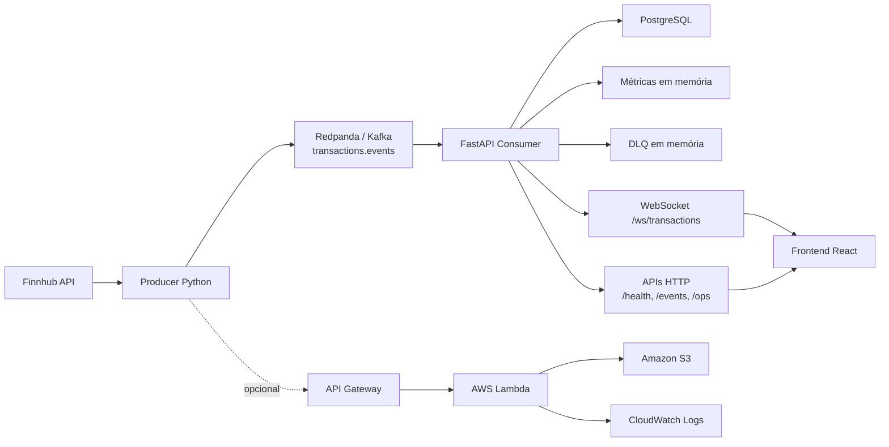
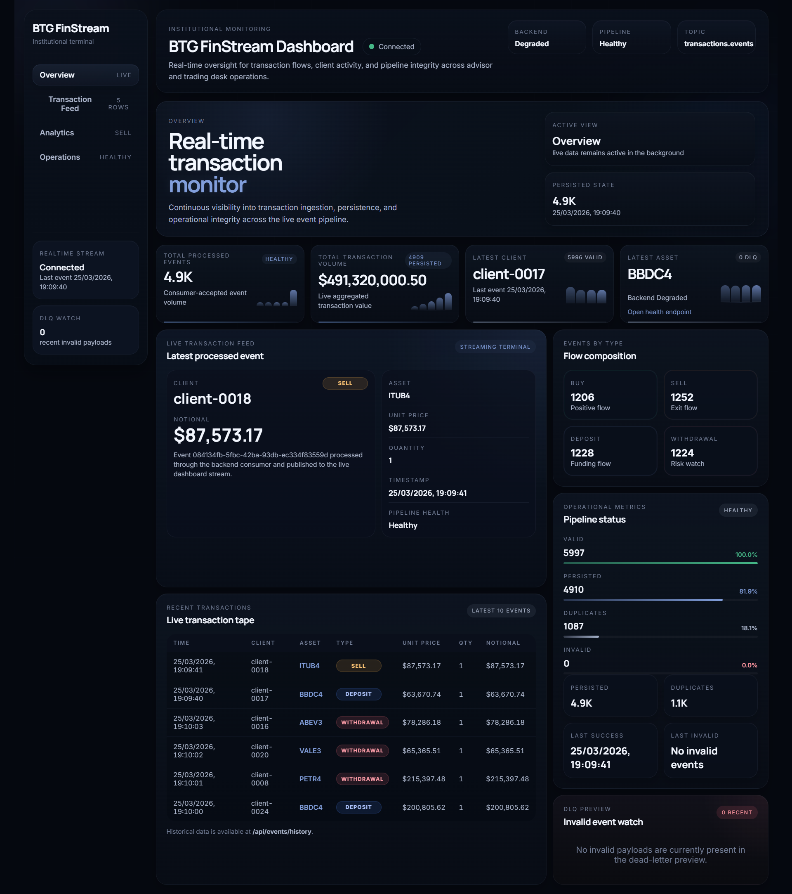
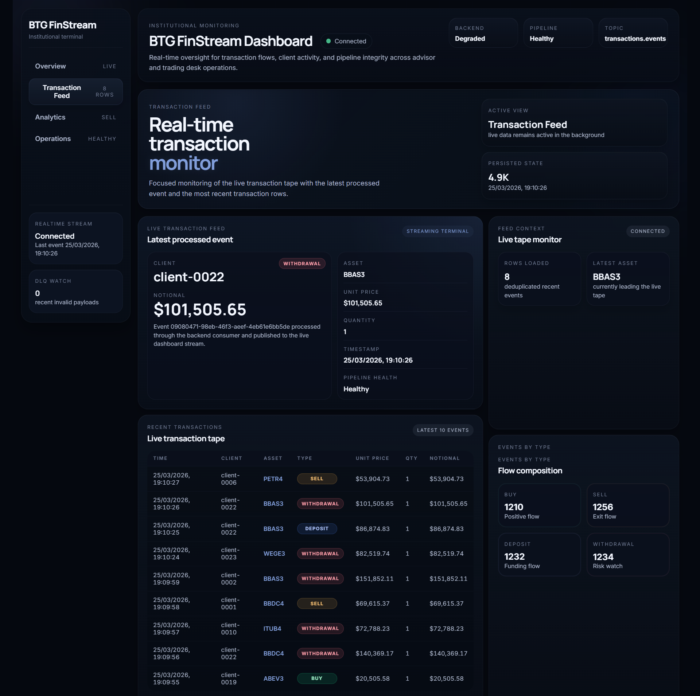
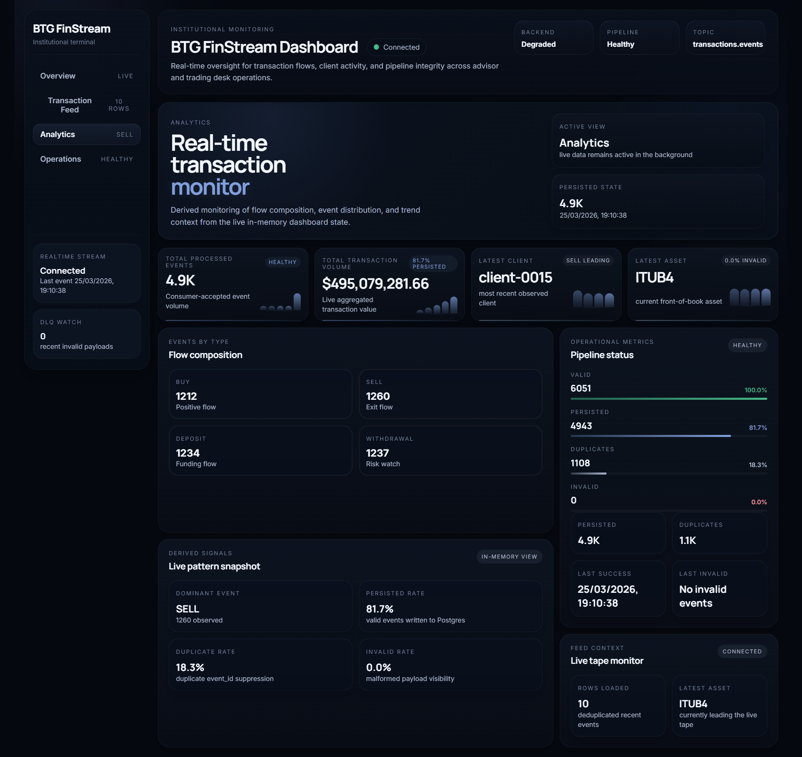
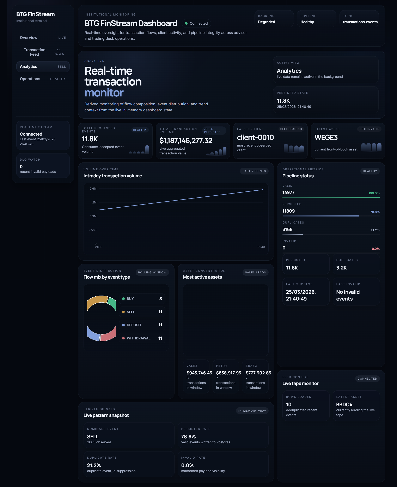
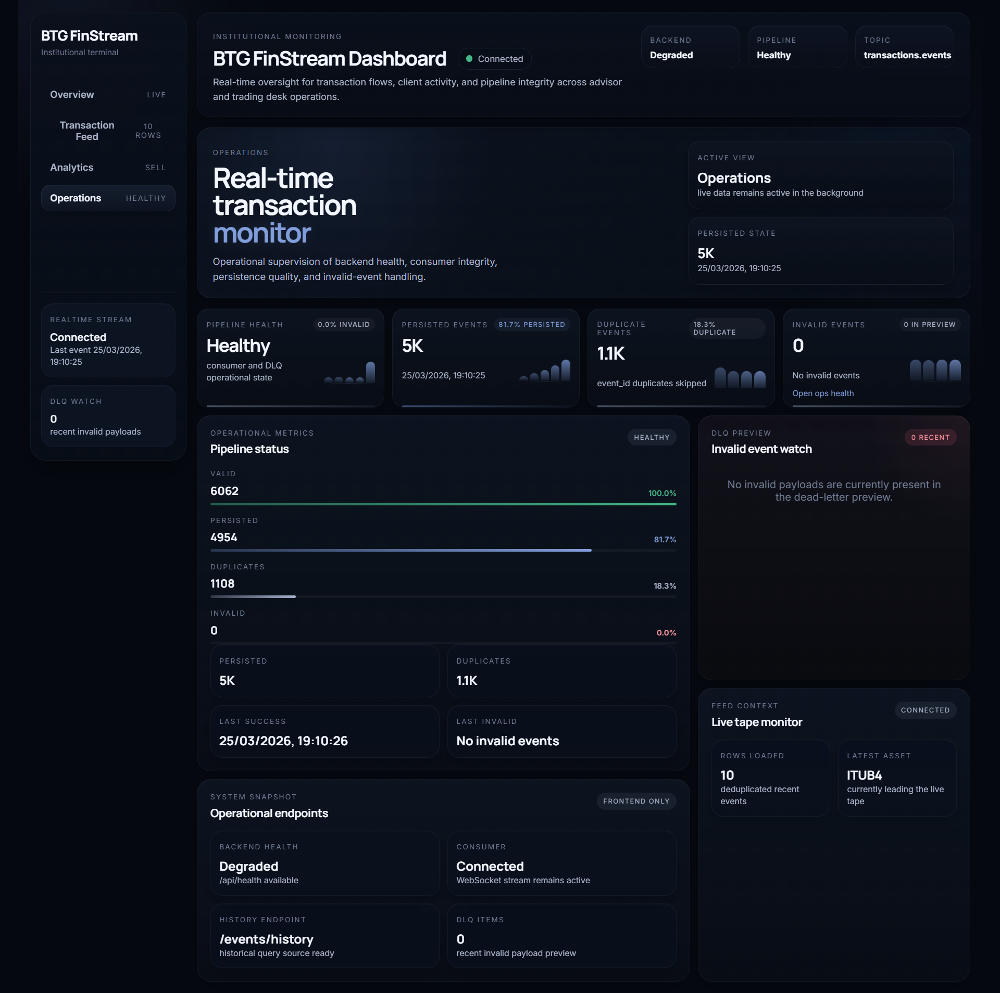

# BTG FinStream Dashboard
**Plataforma de monitoramento financeiro em tempo real para ingestão, processamento, observabilidade e análise de transações orientadas a eventos.**

## Visão Geral

O **BTG FinStream Dashboard** é um sistema de monitoramento de transações financeiras em tempo real, construído para demonstrar uma arquitetura moderna, orientada a eventos, com foco em processamento contínuo, visibilidade operacional e analytics aplicados a fluxo transacional.

Na prática, o projeto resolve um problema clássico de plataformas financeiras: acompanhar o que está entrando no pipeline agora, identificar degradação operacional, preservar histórico consultável e transformar eventos em sinais analíticos úteis para operação, tecnologia e negócio.

A solução combina:

- geração de eventos em Python;
- preços reais via Finnhub;
- streaming local com broker compatível com Kafka;
- processamento backend com FastAPI;
- persistência em PostgreSQL;
- broadcast em tempo real via WebSocket;
- dashboard frontend com visual institucional;
- trilha paralela de ingestão serverless na AWS para validação de arquitetura em nuvem de baixo custo.

## Principais Funcionalidades

- streaming de transações em tempo real com producer em Python
- atualização contínua do dashboard via WebSocket
- analytics com volume ao longo do tempo, distribuição por tipo e concentração por ativo
- trilha opcional de ingestão AWS com API Gateway, Lambda, S3 e CloudWatch
- dados híbridos: preço real de mercado via Finnhub e contexto transacional controlado por simulação
- interface institucional com linguagem visual de terminal financeiro
- persistência histórica em PostgreSQL
- deduplicação por `event_id`
- DLQ em memória para eventos inválidos
- métricas operacionais para acompanhamento do pipeline

## Arquitetura

O sistema suporta dois caminhos de ingestão:

- **fluxo local principal**: `producer -> Redpanda/Kafka -> FastAPI -> PostgreSQL + WebSocket -> React`
- **fluxo cloud opcional**: `producer -> API Gateway -> Lambda -> S3`

O backend local continua sendo o núcleo de processamento e visualização em tempo real. A trilha AWS existe como caminho paralelo de validação arquitetural, sem substituir a stack local.



## Fluxo de Dados

1. O producer seleciona um ativo configurado em `FINNHUB_SYMBOLS`.
2. O preço atual é consultado na Finnhub.
3. O evento financeiro é montado com:
   - preço real (`unit_price`);
   - quantidade simulada (`quantity`);
   - valor nocional (`notional_amount`);
   - cliente simulado (`client_id`);
   - tipo de evento simulado (`event_type`).
4. O evento é enviado para:
   - Kafka/Redpanda no fluxo local; ou
   - API Gateway no fluxo AWS opcional.
5. No fluxo local, o backend:
   - valida o payload;
   - contabiliza eventos válidos e inválidos;
   - evita duplicidade por `event_id`;
   - persiste eventos válidos em PostgreSQL;
   - atualiza métricas em memória;
   - transmite snapshot e eventos ao frontend via WebSocket.
6. O frontend combina:
   - estado ao vivo do WebSocket;
   - histórico carregado por HTTP;
   - agregações derivadas para compor os gráficos e painéis analíticos.

## Stack Tecnológica

### Frontend
- React
- Recharts
- CSS com design system customizado

### Backend
- FastAPI
- PostgreSQL
- WebSocket

### Streaming
- Kafka / Redpanda

### Cloud
- AWS Lambda
- API Gateway
- Amazon S3
- CloudWatch Logs

### API Externa
- Finnhub

## Camada Analítica

A aba `Analytics` foi construída sobre os dados já existentes no sistema, sem alterar o contrato do backend.

Ela combina eventos históricos e eventos ao vivo para gerar três visões principais:

### Volume ao Longo do Tempo
Os eventos são agrupados por bucket de tempo e o sistema soma `notional_amount` por intervalo, permitindo acompanhar a intensidade financeira do fluxo ao longo da janela observada.

### Distribuição por Tipo de Evento
O frontend calcula a composição do fluxo entre:

- `BUY`
- `SELL`
- `DEPOSIT`
- `WITHDRAWAL`

Isso permite entender rapidamente a natureza predominante do tráfego.

### Concentração por Ativo
Os eventos são agregados por `asset`, gerando uma leitura de concentração operacional e destacando os ativos mais relevantes na janela recente.

### Merge entre Histórico e Tempo Real
A camada analítica usa:

- `GET /events/history` para carregar base histórica recente;
- WebSocket para incorporar novos eventos assim que forem processados.

Esse desenho mantém os gráficos vivos sem depender de mudanças no backend.

## Estrutura do Projeto

```text
btg-finstream-dashboard/
|-- frontend/
|   |-- src/
|   |-- package.json
|   `-- Dockerfile
|-- backend/
|   |-- app/
|   |   |-- api/
|   |   |-- core/
|   |   |-- models/
|   |   |-- schemas/
|   |   |-- services/
|   |   |-- websocket/
|   |   `-- main.py
|   |-- requirements.txt
|   |-- pyproject.toml
|   `-- Dockerfile
|-- producer/
|   |-- producer.py
|   |-- requirements.txt
|   `-- Dockerfile
|-- aws/
|   |-- events_ingestion/
|   |   `-- app.py
|   |-- sample-transaction-event.json
|   `-- template.yaml
|-- docs/
|   `-- prints/
```

## Capturas de Tela

### Visão Geral



### Feed de Transações



### Analytics



### Analytics com Gráficos



### Operações



## Executando Localmente

### 1. Subir infraestrutura local

```powershell
cd btg-finstream-dashboard
docker compose -f infra/docker-compose.yml up -d postgres redis redpanda
```

### 2. Rodar o backend

```powershell
cd backend
python -m venv .venv
.venv\Scripts\activate
pip install -r requirements.txt
$env:POSTGRES_HOST="localhost"
$env:POSTGRES_PORT="5433"
$env:POSTGRES_DB="btg_finstream"
$env:POSTGRES_USER="btg"
$env:POSTGRES_PASSWORD="btg_secret"
$env:KAFKA_BROKERS="localhost:19092"
$env:EVENT_TOPIC="transactions.events"
$env:KAFKA_CONSUMER_GROUP="btg-finstream-local"
$env:ENABLE_EVENT_CONSUMER="true"
uvicorn app.main:app --reload --host 0.0.0.0 --port 8000
```

### 3. Rodar o frontend

```powershell
cd frontend
npm install
npm run dev
```

Acesse:

- Frontend: `http://localhost:5173`
- Backend health: `http://localhost:8000/health`

### 4. Rodar o producer no fluxo local

```powershell
cd producer
python -m venv .venv
.venv\Scripts\activate
pip install -r requirements.txt
$env:FINNHUB_API_KEY="SUA_CHAVE_FINNHUB"
$env:FINNHUB_SYMBOLS="AAPL,MSFT,NVDA,GOOGL,AMZN"
$env:EVENT_SINK="kafka"
$env:KAFKA_BROKERS="localhost:19092"
$env:EVENT_TOPIC="transactions.events"
$env:MAX_EVENTS="5"
python producer.py
```

### 5. Validar a aba Analytics

Com backend, frontend e producer rodando:

1. Abra `http://localhost:5173`
2. Acesse a aba `Analytics`
3. Confirme:
   - gráfico de volume ao longo do tempo
   - distribuição por tipo de evento
   - concentração por ativo
4. Gere novos eventos e observe a atualização em tempo real

## AWS Deployment Opcional

A trilha AWS foi pensada para teste econômico e validação arquitetural, sem substituir a stack local.

### Build e deploy com SAM

```powershell
cd btg-finstream-dashboard
sam build --template-file aws/template.yaml
sam deploy --guided --template-file aws/template.yaml
```

Parâmetros recomendados:

- stack name: `btg-finstream-dashboard-ingestion`
- `StackEnvironment`: `test`
- `EventBucketName`: nome globalmente único

### Testar a ingestão via API Gateway

```powershell
curl -X POST "<EVENT_INGESTION_API_URL>" `
  -H "Content-Type: application/json" `
  --data "@aws/sample-transaction-event.json"
```

### Rodar o producer em modo AWS

```powershell
cd producer
$env:FINNHUB_API_KEY="SUA_CHAVE_FINNHUB"
$env:FINNHUB_SYMBOLS="AAPL,MSFT,NVDA,GOOGL,AMZN"
$env:EVENT_SINK="aws"
$env:AWS_API_ENDPOINT="<EVENT_INGESTION_API_URL>"
$env:MAX_EVENTS="5"
python producer.py
```

### Remover recursos para evitar custos

```powershell
aws s3 rm s3://<EVENT_BUCKET_NAME> --recursive
sam delete --stack-name btg-finstream-dashboard-ingestion --no-prompts
```

## Exemplo de Payload

```json
{
  "event_id": "0f2d8d4b-7a26-44f2-b5da-3bfe9bb7e3bd",
  "client_id": "client-0007",
  "asset": "AAPL",
  "event_type": "BUY",
  "unit_price": 252.62,
  "quantity": 50,
  "notional_amount": 12631.0,
  "amount": 12631.0,
  "timestamp": "2026-03-25T21:58:00.000000+00:00"
}
```

## Melhorias Futuras

- motor de detecção de fraude baseado em comportamento transacional
- detecção de anomalias operacionais e de volume
- sistema de alertas para degradação de pipeline e eventos críticos
- expansão da integração com dados de mercado reais
- analytics históricos mais profundos e comparativos
- trilhas adicionais de processamento assíncrono em nuvem

## Autor

Projeto desenvolvido por **Vitória Martins** como estudo aplicado de arquitetura orientada a eventos, processamento em tempo real, backend Python, frontend analítico e desenho de soluções para contexto financeiro.
