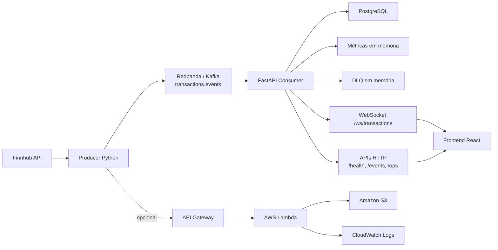

# BTG FinStream Dashboard

Plataforma de monitoramento de transações financeiras em tempo real, orientada a eventos, desenvolvida para demonstrar arquitetura moderna de streaming, resiliência operacional, persistência histórica e visualização institucional com foco em contexto financeiro.

## Visão Executiva

O **BTG FinStream Dashboard** é um projeto de portfólio técnico construído para simular, de forma realista, uma plataforma interna de acompanhamento de operações financeiras. O sistema combina ingestão de eventos, processamento assíncrono, transmissão em tempo real para interface web, persistência relacional e trilha opcional de ingestão serverless na AWS.

O objetivo não é apenas exibir dados em um dashboard, mas demonstrar capacidade de desenhar e implementar uma solução próxima de ambientes reais de operações, assessoria, tecnologia financeira e observabilidade de pipelines.

## Problema de Negócio

Em um ambiente financeiro, times operacionais e tecnológicos precisam responder rapidamente a perguntas como:

- quais transações estão entrando agora;
- quais clientes e ativos estão mais ativos no fluxo;
- se o pipeline está saudável ou degradado;
- se há eventos inválidos ou duplicados;
- se as operações processadas estão sendo persistidas corretamente.

Sem essa visibilidade, a operação perde capacidade de reação, investigação e acompanhamento em tempo real.

## Solução Proposta

O projeto implementa um fluxo enxuto, porém orientado a práticas de produção:

- **Producer em Python** gera eventos transacionais;
- **Finnhub** fornece preço real de mercado para enriquecer o evento;
- **Redpanda/Kafka** recebe os eventos no fluxo local;
- **FastAPI** consome, valida, processa, persiste e retransmite os eventos;
- **PostgreSQL** armazena o histórico;
- **WebSocket** entrega atualizações em tempo real para o frontend;
- **React + Vite** apresenta um dashboard com linguagem visual institucional;
- **métricas operacionais, DLQ e deduplicação** dão resiliência e observabilidade;
- **AWS SAM + API Gateway + Lambda + S3** oferecem uma trilha paralela de ingestão serverless para testes de baixo custo.

## Arquitetura



## Fluxo de Dados de Ponta a Ponta

1. O producer escolhe um símbolo configurado em `FINNHUB_SYMBOLS`.
2. O preço atual do ativo é buscado na Finnhub.
3. O producer monta um evento com contexto híbrido:
   - preço real de mercado;
   - quantidade simulada;
   - cliente simulado;
   - tipo de evento simulado.
4. O evento é enviado para:
   - `transactions.events` no fluxo local com Kafka; ou
   - API Gateway no fluxo AWS com `EVENT_SINK=aws`.
5. No caminho local, o backend:
   - valida o payload;
   - descarta inválidos para DLQ;
   - ignora duplicados;
   - atualiza métricas em memória;
   - persiste no PostgreSQL;
   - transmite via WebSocket.
6. O frontend atualiza métricas, feed, painéis operacionais e histórico visual em tempo real.

## Stack Utilizada

### Backend e dados

- Python
- FastAPI
- SQLAlchemy
- PostgreSQL
- Redpanda
- Redis
- kafka-python

### Frontend

- React
- Vite
- CSS customizado

### Infraestrutura local

- Docker Compose
- Nginx

### Trilha cloud

- AWS SAM
- API Gateway
- AWS Lambda
- Amazon S3
- CloudWatch Logs

### Fonte externa

- Finnhub API

## Principais Funcionalidades

- ingestão de eventos transacionais em tempo real;
- preços reais via Finnhub;
- modelagem financeira com `unit_price`, `quantity` e `notional_amount`;
- persistência histórica em PostgreSQL;
- consumo e broadcast em tempo real via WebSocket;
- dashboard institucional com feed ao vivo;
- métricas operacionais do pipeline;
- DLQ em memória para eventos inválidos;
- deduplicação por `event_id`;
- consulta histórica por filtros;
- trilha serverless opcional para validação em AWS.

## Diferenciais Técnicos

### Arquitetura orientada a eventos

O sistema foi estruturado em torno de um pipeline desacoplado, separando claramente geração, transporte, processamento, persistência e visualização.

### Dados híbridos

O contexto transacional não é totalmente fictício nem totalmente acoplado ao mercado. O projeto usa uma abordagem híbrida:

- **preço real** vindo da Finnhub;
- **cliente, quantidade e tipo de evento simulados** para manter controle e previsibilidade.

Essa abordagem torna os eventos mais realistas sem perder governabilidade durante testes.

### Observabilidade operacional

O backend expõe saúde do pipeline, contadores operacionais, DLQ e estado recente do fluxo, o que aproxima o projeto de uma visão de produção.

### Resiliência

Eventos inválidos não derrubam o fluxo. Eventos duplicados não geram persistência redundante. O sistema mantém o streaming ativo mesmo em cenários degradados.

## Estrutura do Evento

O evento financeiro atual segue este formato:

```json
{
  "event_id": "0f2d8d4b-7a26-44f2-b5da-3bfe9bb7e3bd",
  "client_id": "client-0007",
  "asset": "AAPL",
  "event_type": "BUY",
  "amount": 12631.0,
  "unit_price": 252.62,
  "quantity": 50,
  "notional_amount": 12631.0,
  "timestamp": "2026-03-25T21:58:00.000000+00:00"
}
```

### Significado dos campos

- `event_id`: identificador único da transação
- `client_id`: cliente simulado
- `asset`: ativo financeiro
- `event_type`: `BUY`, `SELL`, `DEPOSIT` ou `WITHDRAWAL`
- `unit_price`: preço unitário do ativo
- `quantity`: quantidade da operação
- `notional_amount`: valor financeiro total da operação
- `amount`: mantido por compatibilidade com o pipeline existente
- `timestamp`: data e hora do evento em ISO 8601

## Estrutura de Pastas

```text
btg-finstream-dashboard/
|-- backend/
|   |-- app/
|   |   |-- api/
|   |   |-- core/
|   |   |-- models/
|   |   |-- schemas/
|   |   |-- services/
|   |   |-- websocket/
|   |   `-- main.py
|   |-- Dockerfile
|   |-- pyproject.toml
|   `-- requirements.txt
|-- frontend/
|   |-- src/
|   |-- package.json
|   `-- Dockerfile
|-- producer/
|   |-- producer.py
|   |-- requirements.txt
|   `-- Dockerfile
|-- infra/
|   |-- docker-compose.yml
|   |-- frontend/
|   |-- postgres/
|   `-- redpanda/
|-- aws/
|   |-- events_ingestion/
|   |   `-- app.py
|   |-- sample-transaction-event.json
|   `-- template.yaml
|-- docs/
|   `-- architecture.md
|-- .env.example
|-- docker-compose.yml
`-- README.md
```

## Como Rodar Localmente

### Opção 1: stack completa com Docker Compose

```powershell
cd C:\Users\vitor\OneDrive\Documentos\Playground\btg-finstream-dashboard
Copy-Item .env.example .env
docker compose up --build
```

Acessos:

- Frontend: [http://localhost:8080](http://localhost:8080)
- Backend health: [http://localhost:8000/health](http://localhost:8000/health)
- Histórico: [http://localhost:8000/events/history](http://localhost:8000/events/history)
- Operações: [http://localhost:8000/ops/health](http://localhost:8000/ops/health)

Para encerrar:

```powershell
docker compose down
```

### Opção 2: desenvolvimento por serviço

#### Infraestrutura

```powershell
cd C:\Users\vitor\OneDrive\Documentos\Playground\btg-finstream-dashboard
docker compose -f infra/docker-compose.yml up -d postgres redis redpanda
```

#### Backend

```powershell
cd C:\Users\vitor\OneDrive\Documentos\Playground\btg-finstream-dashboard\backend
python -m venv .venv
.venv\Scripts\activate
pip install -r requirements.txt
$env:POSTGRES_HOST="localhost"
$env:POSTGRES_PORT="5433"
$env:POSTGRES_DB="btg_finstream"
$env:POSTGRES_USER="btg"
$env:POSTGRES_PASSWORD="btg_secret"
$env:KAFKA_BROKERS="localhost:19092"
$env:EVENT_TOPIC="transactions.events"
$env:KAFKA_CONSUMER_GROUP="btg-finstream-local"
$env:ENABLE_EVENT_CONSUMER="true"
uvicorn app.main:app --reload --host 0.0.0.0 --port 8000
```

#### Frontend

```powershell
cd C:\Users\vitor\OneDrive\Documentos\Playground\btg-finstream-dashboard\frontend
npm install
npm run dev
```

Frontend local: [http://localhost:5173](http://localhost:5173)

#### Producer local com Kafka

```powershell
cd C:\Users\vitor\OneDrive\Documentos\Playground\btg-finstream-dashboard\producer
python -m venv .venv
.venv\Scripts\activate
pip install -r requirements.txt
$env:FINNHUB_API_KEY="sua_chave_finnhub"
$env:FINNHUB_SYMBOLS="AAPL,MSFT,NVDA,GOOGL,AMZN"
$env:EVENT_SINK="kafka"
$env:KAFKA_BROKERS="localhost:19092"
$env:EVENT_TOPIC="transactions.events"
$env:MAX_EVENTS="5"
python producer.py
```

## Variáveis de Ambiente

As configurações principais estão em [.env.example](/C:/Users/vitor/OneDrive/Documentos/Playground/btg-finstream-dashboard/.env.example).

### Backend

- `POSTGRES_DB`
- `POSTGRES_USER`
- `POSTGRES_PASSWORD`
- `POSTGRES_HOST`
- `POSTGRES_PORT`
- `POSTGRES_DSN`
- `ENABLE_EVENT_CONSUMER`
- `KAFKA_CONSUMER_GROUP`
- `CORS_ALLOWED_ORIGINS`

### Streaming

- `KAFKA_BROKERS`
- `EVENT_TOPIC`
- `MARKET_TOPIC`

### Producer

- `FINNHUB_API_KEY`
- `FINNHUB_SYMBOLS`
- `PUBLISH_INTERVAL_SECONDS`
- `MAX_EVENTS`
- `EVENT_SINK`
- `AWS_API_ENDPOINT`
- `AWS_API_TIMEOUT_SECONDS`
- `AWS_API_MAX_RETRIES`

### Frontend

- `VITE_API_BASE_URL`
- `VITE_WS_URL`

## Endpoints Importantes

### Backend local

- `GET /health`
- `GET /events/latest`
- `GET /events/history`
- `GET /ops/health`
- `GET /ops/metrics`
- `GET /ops/dlq`
- `WS /ws/transactions`

### Trilha AWS

- `POST /ingest` no API Gateway

## Trilha Serverless AWS

Esta trilha existe para testes de baixo custo e validação de arquitetura em nuvem, sem substituir o fluxo local.

### O que ela faz

- recebe eventos por HTTP via API Gateway;
- valida o payload na Lambda;
- grava eventos válidos em S3;
- registra sucesso e falhas no CloudWatch;
- permite que o producer opere em `EVENT_SINK=aws`.

### Build e deploy com SAM

```powershell
cd C:\Users\vitor\OneDrive\Documentos\Playground\btg-finstream-dashboard
sam build --template-file aws/template.yaml
sam deploy --guided --template-file aws/template.yaml
```

Parâmetros sugeridos:

- stack name: `btg-finstream-dashboard-ingestion`
- `StackEnvironment`: `test`
- `EventBucketName`: nome globalmente único

### Teste direto da API AWS

```powershell
curl -X POST "<EVENT_INGESTION_API_URL>" `
  -H "Content-Type: application/json" `
  --data "@C:\Users\vitor\OneDrive\Documentos\Playground\btg-finstream-dashboard\aws\sample-transaction-event.json"
```

### Producer em modo AWS

```powershell
cd C:\Users\vitor\OneDrive\Documentos\Playground\btg-finstream-dashboard\producer
$env:FINNHUB_API_KEY="sua_chave_finnhub"
$env:FINNHUB_SYMBOLS="AAPL,MSFT,NVDA,GOOGL,AMZN"
$env:EVENT_SINK="aws"
$env:AWS_API_ENDPOINT="<EVENT_INGESTION_API_URL>"
$env:MAX_EVENTS="5"
python producer.py
```

Observações:

- no modo `EVENT_SINK=aws`, o producer não depende de `kafka-python` em tempo de execução;
- no modo `EVENT_SINK=kafka`, `kafka-python` continua sendo necessário.

### Validação operacional na AWS

Logs da Lambda:

```powershell
aws logs tail /aws/lambda/<NOME_DA_FUNCAO> --follow
```

Objetos no S3:

```powershell
aws s3 ls s3://<EVENT_BUCKET_NAME>/events/ --recursive
```

### Remoção segura da stack

```powershell
aws s3 rm s3://<EVENT_BUCKET_NAME> --recursive
sam delete --stack-name btg-finstream-dashboard-ingestion --no-prompts
```

## Exemplos de Uso

### Saúde e operação

```powershell
curl http://localhost:8000/health
curl http://localhost:8000/events/latest
curl http://localhost:8000/ops/metrics
curl http://localhost:8000/ops/dlq
```

### Histórico persistido

```powershell
curl "http://localhost:8000/events/history?limit=10"
curl "http://localhost:8000/events/history?limit=10&client_id=client-0001"
curl "http://localhost:8000/events/history?limit=10&asset=AAPL"
curl "http://localhost:8000/events/history?limit=10&event_type=BUY"
```

### Consulta direta no PostgreSQL

```powershell
cd C:\Users\vitor\OneDrive\Documentos\Playground\btg-finstream-dashboard
docker compose -f infra/docker-compose.yml exec postgres psql -U btg -d btg_finstream -c "select event_id, client_id, asset, event_type, unit_price, quantity, notional_amount, timestamp, ingested_at from transaction_events order by ingested_at desc limit 10;"
```

## Screenshots

O repositório ainda não possui imagens versionadas do dashboard. Para visualizar a interface:

- desenvolvimento: [http://localhost:5173](http://localhost:5173)
- stack conteinerizada: [http://localhost:8080](http://localhost:8080)

## Evoluções Futuras

- adicionar migrações formais com Alembic;
- persistir DLQ em storage dedicado;
- incluir autenticação e autorização;
- criar testes automatizados de integração e carga;
- adicionar métricas e tracing;
- expandir analytics históricos;
- evoluir a trilha AWS com EventBridge, SQS ou Step Functions quando fizer sentido.

## Valor do Projeto para Portfólio

O **BTG FinStream Dashboard** demonstra domínio prático de temas valorizados em engenharia moderna:

- arquitetura orientada a eventos;
- integração com dado externo real;
- modelagem de eventos financeiros;
- persistência e histórico;
- observabilidade e resiliência;
- streaming para frontend em tempo real;
- experiência visual com linguagem institucional;
- capacidade de trabalhar tanto em stack local quanto em trilha serverless na AWS.

Mais do que uma API isolada, este projeto apresenta uma cadeia completa de ingestão, processamento, visualização e operação, com decisões arquiteturais que fazem sentido em cenários financeiros e plataformas internas de monitoramento.
